# Adwaitaru Icon Theme
An expanded icon pack for the GNOME Desktop (mainly), based on the [Adwaita Icon Theme](https://gitlab.gnome.org/GNOME/adwaita-icon-theme) and inspired by Ubuntu's [Yaru](https://github.com/ubuntu/yaru) theme suite, customized to meet a mixture of both themes' design guidelines (hence the name _Adwaitaru_ = _Adwaita_ + _Yaru_).
Built largely upon the graphic work of GNOME's [Adwaita designers](https://gitlab.gnome.org/GNOME/adwaita-icon-theme/-/blob/master/AUTHORS), Canonical's [Yaru design team](https://github.com/ubuntu/yaru/blob/master/icons/AUTHORS), [GNOME Circle](https://apps.gnome.org/#circle) apps' developers, and assets taken from the [MoreWaita](https://github.com/somepaulo/MoreWaita) icon theme by [Paulo Fino](https://github.com/somepaulo).

## Icon Set

<h3>Apps</h3>

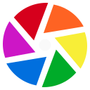

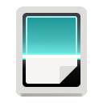

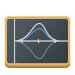

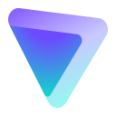

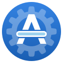

<h3>MIME types</h3>

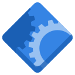
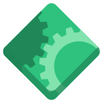

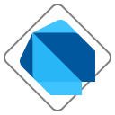

")
")
")
")
")

")

")

")
")

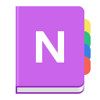

 Project")

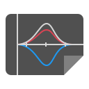

 Package")
")
 Package")
")

")

")

")

")

")

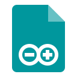
 File")

<h3>Places</h3>

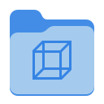

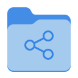

<h3>Devices</h3>

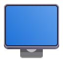

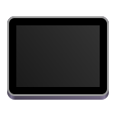

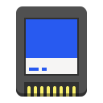

")

